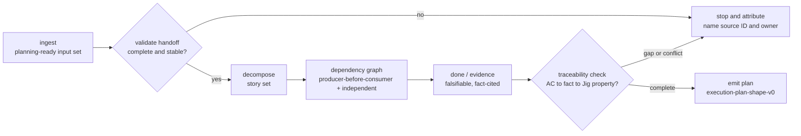

# Flows

design-to-plan runs one transformation: an approved technical-design handoff becomes a Jig-ready
execution plan. This page is the **lifecycle view**; the normative source is the
[contract](design-to-plan-contract.md).

The stages are at **design altitude** — a sequence [`skills/author-design-to-plan`](../../skills/author-design-to-plan/)
automates end to end, or the owner can apply by hand (standalone). Nothing here is a runtime; whether
Planning eventually needs one beyond the shipped skills stays a Product open question, recorded in
[`decisions.md`](decisions.md), D-009.

## Stages

Each stage names the acceptance criterion and contract section it satisfies.

1. **Ingest the planning-ready input set.** Assemble the accepted inputs: the Product PRD with stable
   acceptance-criteria IDs, the approved technical design carrying a complete `Planner Handoff Summary`
   with stable fact IDs (`handoff_contract: technical-design-handoff-v0`), Jig's current
   `execution-plan-shape-v0`, and the track's policy and work-profile references. See
   [Accepted Inputs](design-to-plan-contract.md#accepted-inputs).

2. **Validate the handoff — the stop gate.** Check that required frontmatter, planning approval, and a
   non-blank handoff summary are present, and that fact IDs are stable rather than merely implied by
   methodology prose. If any required input is missing, unstable, contradictory, or would force
   invented scope, the flow **stops and attributes** instead of planning (`AC-STOP-001`,
   `AC-SCOPE-001`; [Refusal and Stop Behavior](design-to-plan-contract.md#refusal-and-stop-behavior)).

3. **Decompose into a story set.** Produce reviewable stories with stable IDs, intent, scope boundary,
   and source references drawn from `DEL-*` delivery facts and Product ACs. The planner does not invent
   implementation package layout (`AC-SCOPE-001`).

4. **Build the dependency and eligibility graph.** Represent producer-before-consumer constraints and
   independent stories explicitly, from `SEQ-*` facts, so hidden dependencies are review-blocking
   (`AC-DAG-001`). Runtime eligibility evaluation stays Jig's.

5. **Attach done / evidence requirements.** Give each story falsifiable evidence — commands or review
   gates when supplied — that cites the Product and design facts it proves, from `VAL-*` facts
   (`AC-EVID-001`).

6. **Run the traceability check.** Confirm every story traces
   `Product PRD AC ID -> Technical Design handoff fact ID -> Jig plan property`, and that every
   in-scope acceptance criterion is either covered or explicitly out of scope with a source-backed
   reason (`AC-TRACE-001`; [Traceability Rule](design-to-plan-contract.md#traceability-rule)). The
   fixture [`examples/minimal-design-to-plan.md`](examples/minimal-design-to-plan.md) shows the chain
   end to end.

7. **Stop or emit.** If any stop condition holds, stop and name the missing or conflicting source ID
   and its owner (`AC-STOP-001`). Otherwise emit a plan that preserves Jig's `execution-plan-shape-v0`
   properties (`AC-PLAN-001`;
   [Required Output Properties](design-to-plan-contract.md#required-output-properties)).

The gate and traceability check both route to the same **stop-and-attribute** outcome: Planning never
produces or revises a plan around a missing or conflicting source — it names the source ID and the
owner responsible for resolving it.

## Standalone and in the suite

The flow is identical either way; only who supplies the seams differs:

| Seam                                  | On its own           | In the suite                   |
| ------------------------------------- | -------------------- | ------------------------------ |
| Product PRD + AC IDs (input)          | You supply it        | `define-product` produces it   |
| `technical-design-handoff-v0` (input) | You supply it        | `technical-design` produces it |
| `execution-plan-shape-v0` (output)    | You consume the plan | `jig` consumes it              |

The suite tools are strong defaults, not prerequisites: Planning's hard input boundary is an approved
design handoff with stable fact IDs, and its output is a plan in the execution-plan shape.
